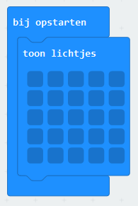
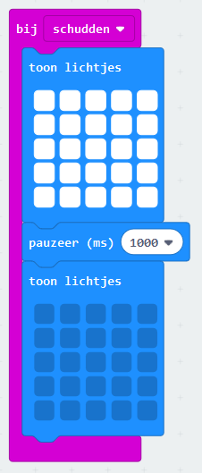
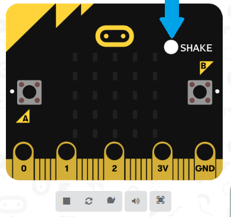

# Begin simpel!

Een sneeuwbol bestaat uit een doorzichtige (halve) bol met daarin een tafereel (meestal een landschap) en (witte) deeltjes die de sneeuwvlokken voor moeten stellen. Als je de bol schudt, dan dwarrelen de "sneeuwvlokken" door de bol en dalen langzaam weer neer. Daardoor lijkt het alsof er een sneeuwbui valt.

De micro:bit heeft een vierkant van 5 bij 5 lichtjes. Die gaan we gebruiken om de inhoud van onze sneeuwbol na te bootsen. Gelukkig kunnen de lichtjes van de micro:bit niet ontsnappen, dus we hebben geen doorzichtige bol nodig!

Laten we simpel beginnen en eerst alleen de sneeuwvlokken maken. Bij het opstarten willen we dat alle lichtjes uit zijn (want we hebben nog geen tafereel). Verwijder daarom het `de hele tijd` blok en voeg aan het `bij opstarten` blok een `toon lichtjes` blok toe. Er moeten nog geen lichtjes branden, dus het zou er als volgt uit moeten zien:

Om de micro:bit te laten reageren op schudden, voegen we een `bij schudden` blok toe met daarin 2 `toon lichtjes` blokken met ertussen een `pauzeer (ms) 1000` blok. In het eerste `toon lichtjes` blok zetten we alle lichtjes aan (een sneeuwstorm!) en in het tweede `toon lichtjes` blok zetten we alle lichtjes weer uit. De code daarvoor ziet er als volgt uit:

Je kunt je programma meteen testen, zonder het echt op een micro:bit te zetten. Aan de linkerkant in je browser zie je een weergave van een micro:bit. Alle lichtjes zijn uit, want dat heb je in het `bij opstarten` blok geprogrammeerd. Test nu wat er gebeurt als je de micro:bit zou schudden. Dat kun je doen door met de muis op de witte cirkel naast het woord SHAKE (Engels voor schudden) te klikken:

Werkt het? Het ziet er nog wel heel simpel uit: eerst alles sneeuw en meteen daarna helemaal geen sneeuw. Dat moet beter kunnen!

[Naar de volgende stap >>](stap_2.md)

 Dit werk valt onder een <a rel="license" href="http://creativecommons.org/licenses/by-nc-sa/4.0/deed.nl">Creative Commons Naamsvermelding-NietCommercieel-GelijkDelen 4.0 Internationaal-licentie</a>.
