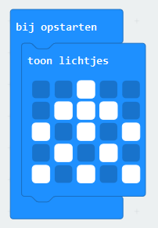
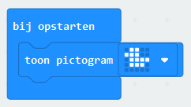
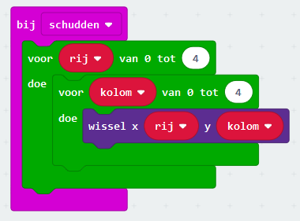
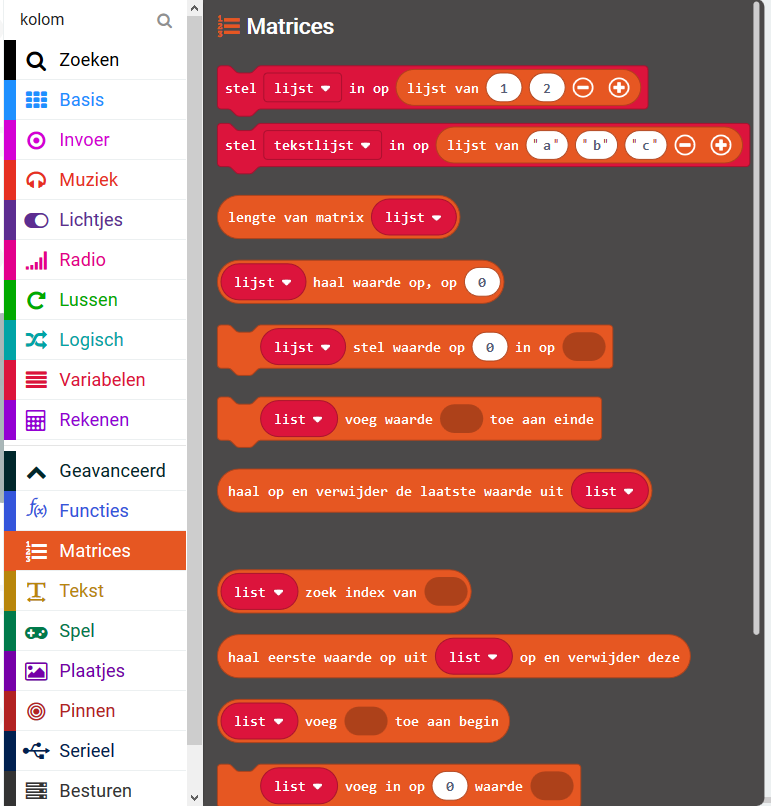

# Een tafereel maken

Nu we de sneeuwvlokken goed werkend hebben, wordt het tijd om een tafereel toe te voegen. Een tafereel maken we door een plaatje te tonen op de micro:bit. Dat kan op 2 manieren:

1. Met het `toon lichtjes` blok. Teken alle lichtjes van je plaatje, bijvoorbeeld een kerstboom:

2. Met het `toon pictogram` blok. Selecteer het plaatje dat jou leuk lijkt, biijvoorbeeld een eendje:

Test je nieuwe sneeuwbol door met de muis op de witte cirkel op de micro:bit te klikken.

Je zult merken dat als alle sneeuw is neergedaald, dat dan ook je tafereel is verdwenen. Dat is natuurlijk niet de bedoeling! Als de sneeuw is neergedaald, dan moet je oorspronkelijke plaatje weer getoond worden.

Bedenk hoe je dit zou kunnen verbeteren. Bijvoorbeeld:

- Zet als begin van je sneeuwbui niet alle lichtjes aan, maar zet alleen de lichtjes aan die uit waren (dus de lichtjes die niet bij het plaatje horen) en zet alle lichtjes uit die aan waren (dus alle lichtjes die wel bij het plaatje horen). Gebruik daarvoor het `wissel x ... y ...` blok en `voor ... van 0 tot ... doe` lussen.

- Zet alleen die lichtjes uit die niet bij het oorspronkelijke plaatje horen. Alleen, hoe weet je wat je oorspronkelijke plaatje is? Daarvoor heb je misschien een lijst of meerdere lijsten nodig. Lijsten kun je maken met blokken die je vindt door onder **Geavanceerd** op **Matrices** te klikken.

[Naar de volgende stap >>](stap_4.md)

 Dit werk valt onder een <a rel="license" href="http://creativecommons.org/licenses/by-nc-sa/4.0/deed.nl">Creative Commons Naamsvermelding-NietCommercieel-GelijkDelen 4.0 Internationaal-licentie</a>.
