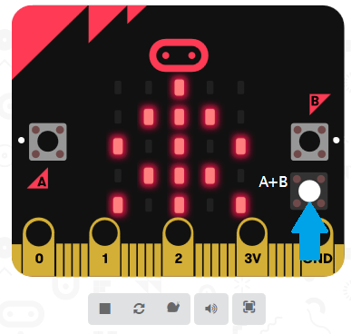

# Uitdaging: Meer taferelen

Een echte sneeuwbol kan maar één tafereel tonen. Het leuke van software is dat je je programma zo flexibel kunt maken als je zelf wilt! Bijvoorbeeld een sneeuwbol met meerdere taferelen.

Op dit moment heb je één tafereel dat verschijnt als je de micro:bit aanzet. Verzin een paar andere plaatjes die een tafereel voorstellen en toon deze plaatjes als op knop A of B op de micro:bit gedrukt wordt. Gebruik hiervoor het `wanneer knop ... wordt indrukt` blok samen met een `toon lichtjes` of een `toon pictogram` blok.

Je kunt zelfs nog een ander plaatje tonen als knoppen A en B tegelijk worden ingedrukt op de micro:bit. Als je dat in de browser test, dan zie je een extra knop A+B verschijnen op de weergave van de micro:bit. Druk op de witte cirkel om knoppen A en B tegelijk in te drukken:

Als je op knop A of B (of A+B) drukt en daarna de micro:bit schudt (klik op SHAKE), dan kan het zijn dat je na de sneeuwbui niet met het juiste plaatje eindigt. Als dat zo is, pas dan de code aan die je in de vorige stap geschreven hebt en deel uitmaakt van het `bij schudden` blok.

[Naar de volgende stap >>](stap_5.md)

 Dit werk valt onder een <a rel="license" href="http://creativecommons.org/licenses/by-nc-sa/4.0/deed.nl">Creative Commons Naamsvermelding-NietCommercieel-GelijkDelen 4.0 Internationaal-licentie</a>.
