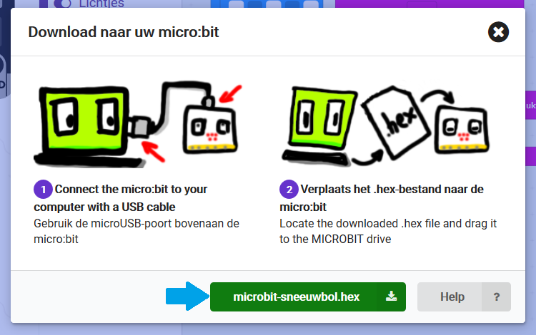

# Testen op de micro:bit

Genoeg getest op het droge; het is tijd om in het diepe te springen! Nu je je programma genoeg getest hebt in de browser en er geen fouten meer in zouden mogen zitten, gaan we je programma testen op een echte micro:bit.

Geef je project een naam en klik dan op de Downloaden knop:

In het bovenstaande plaatje hebben we ons project sneeuwbol genoemd, maar je mag natuurlijk je eigen naam verzinnen. Na het klikken op de Downloaden knop krijg je het volgende schermpje te zien:

Zoals in dit schermpje te zien is kun je nu de micro:bit aansluiten op je computer met een USB-kabel. Klik daarna op de knop met microbit-sneeuwbol.hex. (Als je je project een andere naam dan sneeuwbol hebt gegeven, dan staat op de knop microbit-*jouwprojectnaam*.hex.) Sla het bestand op op de micro:bit, of sla het bestaand eerst op op je computer en verplaats het bestand daarna naar de micro:bit. Zorg dat de batterijen aangesloten zijn op de micro:bit en haal de USB-kabel van de micro:bit. Nu kun je je programma in het echt gaan testen!

 Dit werk valt onder een <a rel="license" href="http://creativecommons.org/licenses/by-nc-sa/4.0/deed.nl">Creative Commons Naamsvermelding-NietCommercieel-GelijkDelen 4.0 Internationaal-licentie</a>.
